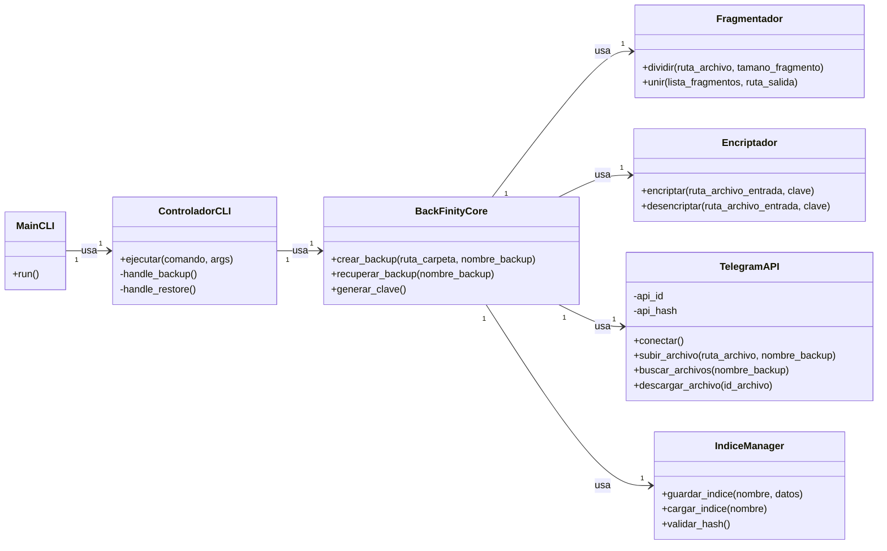

# **Scrum aplicado a BackFinity** 

  - Proyecto: **BackFinity**
  - Tecnología: **Python**
  - Metodología: **Scrum**
  - Nota: **PO + SM + Dev** Único, Scrum ligero para una sola persona.

-----

## **Pre-Sprint 0: Preparación y Product Backlog Inicial (Día 1 - 3)**

**Actividad principal:**

  * Definir alcance del MVP (Producto Mínimo Viable): **subir** y **recuperar** un único backup desde la línea de comandos.
  * Crear repositorio de GitHub y configurar el entorno de desarrollo inicial.
  * Esbozar la arquitectura inicial.

### Análisis del Dominio

**Product Backlog inicial (priorizado)**:

1.  **HU1**: Como usuario, quiero ejecutar BackFinity desde la terminal con comandos de respaldo y restauración.
2.  **HU2**: Como usuario, quiero encriptar una carpeta para asegurar la privacidad de mis archivos.
3.  **HU3**: Como usuario, quiero fragmentar el archivo encriptado en partes de 2 GB.
4.  **HU4**: Como usuario, quiero subir los fragmentos de mi backup a mi cuenta de Telegram.
5.  **HU5**: Como usuario, quiero restaurar mi backup buscando los archivos en Telegram por un nombre único.
6.  **HU6**: Como usuario, quiero que el sistema me muestre el progreso de la subida o la descarga.
7.  **HU7**: Como desarrollador, quiero tener pruebas unitarias para validar la encriptación y la fragmentación.
8.  **HU8**: Como usuario, quiero que el sistema verifique la integridad del archivo original al restaurarlo.

Para más información consulte [Product Backlog](./product-backlog.md)

-----

### Diseño Estático Inicial

  - Lenguaje: Python
  - Sistema Operativo: Multiplataforma (Linux, Windows, macOS)
  - Arquitectura: Arquitectura de 3 capas (Presentación, Lógica de Negocio, Datos)

**Diagrama de Clases Inicial (MVP)**



#### Construcción del diagrama

El diagrama de clases presenta una arquitectura modular y orientada a objetos, separando las responsabilidades en capas lógicas para facilitar el desarrollo, las pruebas y el mantenimiento.

#### Explicación de cada componente y su interacción

##### 1\. **Capa de Presentación**

  * **`MainCLI`**: Es el punto de entrada de la aplicación. Se encarga de analizar los argumentos de la línea de comandos y delegar la ejecución al `ControladorCLI`.
  * **`ControladorCLI`**: Actúa como el intermediario entre la interfaz de usuario (la terminal) y la lógica de negocio. Recibe los comandos del usuario y llama a los métodos correspondientes en la clase `BackFinityCore`.

##### 2\. **Capa de Lógica de Negocio**

  * **`BackFinityCore`**: El corazón del sistema. Contiene la lógica central del proyecto. Orquesta la secuencia de encriptación, fragmentación y subida, y también el proceso inverso de descarga y restauración. Utiliza los otros módulos de esta capa para realizar sus funciones.
  * **`Fragmentador`**: Módulo con la única responsabilidad de dividir y unir archivos. Es independiente de la lógica de negocio y puede ser reutilizado en otros contextos.
  * **`Encriptador`**: Módulo que maneja las operaciones de encriptación y desencriptación. Utiliza una biblioteca como `PyCryptodome` o `cryptography`.

##### 3\. **Capa de Datos (o Servicios)**

  * **`TelegramAPI`**: Encapsula toda la interacción con la API de Telegram. Sus responsabilidades son la conexión, la subida de archivos, la búsqueda de archivos y la descarga. Esto aísla la lógica de negocio de los detalles de la API de terceros.
  * **`IndiceManager`**: Módulo que gestiona la persistencia del índice de los backups (nombre, clave, fragmentos, etc.). Su responsabilidad es guardar y cargar esta información, asegurando que el proceso de restauración sea posible.

-----

#### Flujo general de interacción

1.  El usuario ejecuta `python backfinity.py --backup` en la terminal.
2.  `MainCLI` llama al método `handle_backup` en el `ControladorCLI`.
3.  `ControladorCLI` invoca al método `crear_backup` en `BackFinityCore`.
4.  `BackFinityCore` usa el `Encriptador` para cifrar la carpeta y el `Fragmentador` para dividir el archivo en partes.
5.  `BackFinityCore` le pide a `TelegramAPI` que suba cada fragmento al canal de Telegram.
6.  `BackFinityCore` le pide a `IndiceManager` que guarde la información del backup en un archivo de índice.

-----

### Configuración del Entorno

#### Estructura de carpetas

```
BackFinity/
│
├── src/                         # Código fuente en Python
│   ├── main.py                 # Punto de entrada del programa
│   ├── core.py                 # Clase BackFinityCore
│   ├── controllers/            # Controladores
│   │   └── cli.py              # Controlador de la línea de comandos
│   ├── services/               # Lógica de negocio y servicios
│   │   ├── fragmenter.py       # Módulo de fragmentación
│   │   ├── cryptographer.py   # Módulo de encriptación
│   │   ├── telegram_api.py     # Interacción con Telegram
│   │   └── index_manager.py    # Gestión del índice
│   └── utils/                  # Utilidades
│       └── config.py           # Configuración del proyecto
│
├── tests/                       # Pruebas unitarias
│
├── data/                        # Archivos de ejemplo y backups
│
├── .gitignore                  # Archivos y carpetas ignoradas por Git
├── README.md                   # Descripción y guía rápida del proyecto
└── requirements.txt            # Dependencias de Python (pycryptodome, pyrogram, etc.)
```

#### Software

  * **Python 3.8+**
  * **Gestor de paquetes `pip`**

<!-- end list -->

```bash
python3 -m venv venv
source venv/bin/activate
pip install -r requirements.txt
```

  * **Git para control de versiones**
  * **Editor: Visual Studio Code**

### Anexos

#### **Sprint 1 (2 semanas)**

**Objetivo del sprint**: BackFinity sube y restaura un único backup desde la línea de comandos.
**Historias seleccionadas**: HU1, HU2, HU3, HU4, HU5, HU6.
**Entregable**: Versión v0.1 funcional con la CLI, incluyendo el proceso completo de respaldo y restauración.

-----

#### **Sprint 2 (2 semanas)**

**Objetivo**: Mejorar la fiabilidad y usabilidad.
**Historias seleccionadas**: HU7, HU8.
**Entregable**: v0.2 con pruebas unitarias para la encriptación y la fragmentación, además de la verificación de la integridad del archivo.

-----

#### **Herramientas de seguimiento**

  * **GitHub Projects**: Kanban (To do / In progress / Done).
  * **GitHub Issues**: Cada HU como *issue*, con etiquetas como *enhancement* o *bug*.
  * **GitHub Releases**: Publicar las versiones al final de cada *sprint*.